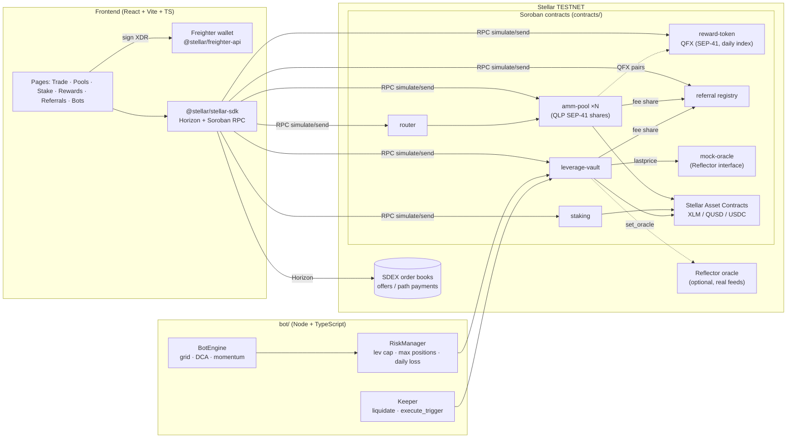

<p align="center">
  
</p>

<p align="center">
  
</p>

# Quasaria

**A quasar-bright decentralized exchange scaffold for the Stellar network.**
SDEX order books + Soroban AMM pools, staking orbits, the QFX holder-reward token,
an on-chain referral constellation, and leveraged trading bots with a liquidation
keeper. **Everything defaults to Stellar TESTNET.**

> [!CAUTION]
> **Unaudited · testnet only · not financial advice.** This repository is an
> educational scaffold. The smart contracts have **not** been audited and must not
> be deployed to mainnet or used with real funds. Leveraged trading and
> yield-bearing tokens carry a high risk of loss (including total loss of margin)
> and may be subject to securities, derivatives, consumer-protection, tax and
> licensing regulation in your jurisdiction. Nothing here is investment, legal or
> tax advice. Automated bots can malfunction, act on stale prices or trade into
> losses. Use at your own risk.

---

## Name & theme

**Quasaria** (one word) comes from *quasar* — the brightest objects in the
universe, where a black hole's accretion disk fires relativistic jets across
space. It fits an exchange where liquidity spirals in and trades shoot out at the
speed of light. A quick web search found no well-known crypto project with this
name (only an unrelated automation consultancy and a game setting), and it is
distinct from "Stellar" itself.

**Theme — deep space + quasar plasma.** Near-black `#05030f` void, indigo glass
cards with gradient hairlines, and neon accents: quasar cyan `#38f3ff`, plasma
magenta `#ff3dcb`, nebula violet `#9b5cff`, solar gold `#ffd166`. Typography is
Orbitron (display), Space Grotesk (body) and JetBrains Mono (numbers), all
self-hosted. Every page gets its own animated cosmic scene: **Quasar Core**
(Trade), **Nebula Drift** (Pools), **Orbital Rings** (Stake), **Supernova**
(Rewards), **Constellations** (Referrals), **Warp Speed** (Bots). The illustrative
logo is a Q built from a quasar: the tilted accretion disk forms the bowl and the
relativistic jet is the tail. Full brand guide: [`docs/THEME.md`](docs/THEME.md).

| Trade — Quasar Core | Pools — Nebula Drift | Stake — Orbital Rings |
|---|---|---|
|  |  |  |
| **QFX Rewards — Supernova** | **Referrals — Constellations** | **Bots & Leverage — Warp Speed** |
|  |  |  |

---

## Features at a glance

| # | Feature | On-chain (Soroban / Stellar) | Off-chain |
|---|---|---|---|
| 1 | **Core DEX** | Stellar **SDEX** (manage buy/sell offers, strict-send path payments, automatic trustlines) + `amm-pool` / `router` contracts | Horizon order books, trade aggregations, path finding; Freighter signing |
| 2 | **QFX holder-reward token** | `reward-token`: SEP-41 token, balances stored as shares, global index compounds daily, capped APR, max-supply-bounded emission | Rewards page: countdown to next compounding, calculator |
| 3 | **Liquidity providing** | `amm-pool`: x·y=k, SEP-41 **QLP** share token, 0.30% fee accrues to LPs | Pools page: deposit/withdraw, fee APR estimate |
| 4 | **Staking** | `staking`: admin-whitelisted pools, per-pool reward rate, funded reserves, optional lock | Stake page |
| 5 | **Referrals** | `referral`: set-once, no self-referral, no cycles; pools & vault pay referrers a share of fees | Referral dashboard, `?ref=` shareable link |
| 6 | **Bot leverage trading** | `leverage-vault`: collateral, positions with max-leverage cap, health-factor liquidation, operator delegation, on-chain SL/TP; `mock-oracle` with a Reflector-compatible interface | `bot/`: grid / DCA / momentum strategies, risk manager, paper vault, liquidation + SL/TP keeper |

---

## Architecture



### Repository layout

```
contracts/            Cargo workspace (soroban-sdk 28), one crate per contract
  reward-token/       QFX: SEP-41 holder-reward token (index/shares)
  amm-pool/           constant-product pool + QLP SEP-41 LP token
  router/             multi-hop exact-in swap router
  staking/            whitelisted multi-pool staking with locks
  referral/           referral registry (set once, no self, no cycles)
  leverage-vault/     margin/leverage vault, health-factor liquidation
  mock-oracle/        Reflector-compatible price oracle for tests/testnet
frontend/             React + Vite + TS dApp (Freighter, stellar-sdk)
  public/brand/       logo.svg (illustrative master), favicon.svg (small variant)
  src/components/     CosmicBackground (6 animated scenes), Layout, OrderBook, ...
  src/pages/          Trade, Pools, Stake, Rewards, Referrals, Bots
bot/                  TypeScript bot + keeper service (vitest tests)
scripts/              build.sh, deploy-testnet.sh, seed-testnet.sh,
                      render-brand.mjs, screenshots.mjs
docs/                 THEME.md brand guide, brand renders
screenshots/          headless-Chromium captures of every page
```

---

## Setup

Prerequisites (versions used to build this scaffold):

| Tool | Version | Install |
|---|---|---|
| Rust | ≥ 1.91 (soroban-sdk 28 MSRV); tested 1.98 | `rustup` |
| Wasm target | `wasm32v1-none` | `rustup target add wasm32v1-none` |
| Stellar CLI | 28.0.0 | [releases](https://github.com/stellar/stellar-cli/releases) or `cargo install --locked stellar-cli` |
| Node.js | ≥ 22.12 (stellar-sdk 17 / vitest 5) | nodejs.org |
| Freighter | latest, set to **Testnet** | freighter.app |

```bash
# everything: contract tests + wasm, bot typecheck + tests, frontend build
./scripts/build.sh

# or piecemeal
(cd contracts && cargo test && stellar contract build)
(cd bot && npm ci && npm run typecheck && npm test)
(cd frontend && npm ci && npm run build)
```

### Run the frontend

```bash
cd frontend && npm run dev          # http://127.0.0.1:5173
```

Without a wallet or deployed contracts the app runs in **read-only demo mode**:
the SDEX order book is fetched live from Horizon testnet (falling back to demo
data if unreachable/empty), and Soroban-backed panels show demo numbers. Set
`VITE_OFFLINE_DEMO=1` to avoid all network calls.

### Run the bot

```bash
cd bot
npm run paper                        # simulated vault + deterministic random walk
npm start -- --config quasaria-bot.config.example.json --mode paper --ticks 1000
cp .env.example .env                 # then fill in testnet IDs + operator key
npm run keeper                       # live liquidation / SL-TP keeper (testnet)
npm start -- --config my-bot.json --mode live
```

The Bots page can export a config (`quasaria-bot.config.json`) that `parseConfig`
validates (testnet only, leverage ≤ risk cap ≤ 20×).

---

## Testnet deployment

```bash
cd contracts && stellar contract build && cd ..
DRY_RUN=1 ./scripts/deploy-testnet.sh   # preview every CLI command
./scripts/deploy-testnet.sh             # deploy (refuses anything but NETWORK=testnet)
./scripts/seed-testnet.sh               # mint demo QUSD/QFX, add liquidity, fund rewards
cd frontend && npm run dev              # picks up frontend/.env.local written by deploy
```

What `deploy-testnet.sh` does:

1. Adds the `testnet` network, creates + friendbot-funds identity `quasaria-admin`.
2. Resolves the native XLM SAC and deploys a SAC for demo stablecoin `QUSD:<admin>`.
3. Deploys `referral` (20% fee share), `reward-token` (QFX, 12% APR, 1B cap),
   two `amm-pool`s (XLM/QUSD, QFX/QUSD, 0.30% fee), `router`, `staking`,
   `mock-oracle` (14 decimals) and `leverage-vault` (10× max, 5% maintenance,
   5% liquidation bonus, 0.10% open fee, 15-min max price age) using constructor
   arguments.
4. Wires permissions: pools + vault as referral fee sources, XLM market enabled,
   initial oracle price, two staking pools (QFX 7-day lock; XLM/QUSD QLP flexible).
5. Writes `deployments/testnet.json`, `frontend/.env.local`, `bot/.env`.

**Using Reflector instead of the mock oracle:** the vault only needs
`lastprice(Asset) -> Option<PriceData>` and `decimals()`, with the same XDR
shapes as Reflector (`Asset::Stellar(Address) | Asset::Other(Symbol)`,
`PriceData { price: i128, timestamp: u64 }`). Look up the current Reflector
testnet contract for the feed you want at reflector.network, then
`stellar contract invoke --id <vault> ... -- set_oracle --oracle <reflector_id>`
and enable markets whose `Asset` key matches that feed. Verify the asset symbols
and decimals of the feed before trusting it.

---

## How each feature works

### 1. Core DEX — SDEX order book + Soroban AMM

*On-chain.* Classic Stellar operations do the order-book trading: limit orders
are `manageBuyOffer` / `manageSellOffer`; market-style swaps use
`pathPaymentStrictSend` over paths returned by Horizon (the SDEX and Stellar's
built-in liquidity pools). Missing trustlines are added with `changeTrust` in the
same transaction. For Soroban pools, `router.swap_exact_in(user, pools[], token_in,
amount_in, min_out, deadline)` pulls input from the user into the first pool and
sends each intermediate output **straight to the next pool**, which swaps the
pre-paid surplus (`swap_prepaid`). The router never holds funds, and it enforces
slippage (`min_out`) and a deadline.

*Off-chain.* `frontend/src/lib/stellar.ts` loads order books, trade aggregations
and paths from Horizon and builds the XDR. `soroban.ts` simulates and prepares
contract calls. Freighter signs.

### 2. QFX — holder reward token with daily compounding

*On-chain* (`contracts/reward-token`):
- The token implements the SEP-41 `TokenInterface` from soroban-sdk (balance,
  transfer, approve/allowance, burn, metadata). Name "Quasaria Flux", symbol QFX, 7 decimals.
- Balances are stored as **shares**: `balance = shares × index / 1e18`.
- `index` starts at 1.0. For each full UTC day since `genesis` it is multiplied by
  `(1 + APR/365)`. The update is lazy: exponentiation-by-squaring covers all
  elapsed days in O(log n), and it runs before any transfer, mint or burn (or
  anyone can call `accrue`). All holders compound together, with no loop over holders.
- **Rate governance:** the admin sets `apr_bps`, which is hard-capped at
  `MAX_APR_BPS = 2500` (25% APR ≈ 28.4% APY). A rate change accrues at the old
  rate first. `current_apy_bps` returns the effective compounded APY.
- **Funding / emission model:** interest is **minted**, so it's inflationary
  and is never taken from other holders. It's bounded by `max_supply`: if
  compounding would push supply past the cap, the index is clamped to land
  exactly on it and rewards stop. The cap can only be lowered, never raised.
  Rounding favours the protocol (floor on credit, ceil on debit).
- Contracts that hold QFX, like AMM pools, also earn. `amm-pool.sync()`
  absorbs that growth into reserves, which benefits LPs.

*Off-chain.* The Rewards page shows the balance, a countdown to the next
compounding tick, the index, emission usage and a compounding calculator.

### 3. Liquidity providing

*On-chain* (`contracts/amm-pool`): constant-product `x·y=k` pools between any two
SEP-41 tokens (SACs for classic assets). `deposit` mints **QLP** shares:
√(a·b) on the first deposit (1,000 units are locked permanently to block
share-inflation attacks), then pro-rata at the optimal ratio with min-amount
slippage guards. `withdraw` burns shares for the pro-rata reserves. The pool
contract is itself a SEP-41 token for QLP, so QLP can be transferred or staked.
A swap fee (default 30 bps, max 100) is taken on input and stays in the reserves,
so **fees accrue to LPs** through a growing `k`. The exception is the referral
cut (below).

### 4. Staking

*On-chain* (`contracts/staking`): the admin whitelists pools
`(stake_token, reward_token, reward_rate/sec, lock_seconds)`. Rewards stream
MasterChef-style through an accumulated reward-per-share, which is O(1) per user.
**Only funded rewards are paid**: `fund` tops up a reserve, and emission pauses
when it runs out. Each stake sets `unlock_at = max(unlock_at, now + lock)`.
`unstake` reverts before that time, while `claim` always works. The admin can
change rates or deactivate a pool, and users can still exit.

### 5. Referral program

*On-chain* (`contracts/referral`): `set_referrer(user, referrer)` can be called
once per user. Self-referral is rejected, and cycles are rejected by walking the
referrer's ancestor chain (up to 32 hops). Pools and the vault are admin-approved
**fee sources**. On every swap, the pool looks up the trader's referrer and pays
them `share_bps` (default 20%) of the swap fee in the input token. The vault
credits the same share of its opening fee. The fee source then calls
`record_reward` so earnings can be tracked per referrer and token.

*Off-chain.* The Referrals page shows your shareable link
`https://…/?ref=G…`. The app captures `?ref=` into localStorage and asks the
invitee to confirm it on-chain. It also shows referral count, earnings and activity.

### 6. Bot leverage trading

*On-chain* (`contracts/leverage-vault`):
- Users `deposit` a collateral token (QUSD on testnet) and then call
  `open_position(caller, owner, asset, is_long, margin, leverage_bps)`.
  Leverage is capped by the admin config, which is itself capped at 20×.
  Notional = margin × leverage, and entry is the oracle price.
- PnL: `size × (price − entry) / entry` (negated for shorts).
  **Health factor** = equity ÷ (notional × maintenance margin). When HF < 1.0,
  **anyone** can `liquidate`. The liquidator receives a bonus (5% of margin,
  capped by the remaining equity), losses go to the reserve, and any leftover
  equity goes back to the owner.
- Counterparty: a **liquidity reserve** (`fund_liquidity`) pays profits and
  absorbs losses. Payouts are capped by the reserve, so the vault never pays
  unbacked PnL.
- **Operator delegation:** `set_operator(user, bot)` lets a bot key open and
  close positions and set triggers, but it can **never withdraw**.
- **On-chain SL/TP:** `set_triggers(id, stop_loss, take_profit)`. Any keeper can
  call `execute_trigger(id)` once a trigger price is crossed.
- **Oracle:** Reflector-compatible `lastprice`, with a staleness bound
  (`max_price_age`). `mock-oracle` implements the same interface for tests and demos.

*Off-chain* (`bot/`):
- **Strategies:** `GridStrategy` (levels across a price band, opens on level
  crossings and exits one grid step later), `DcaStrategy` (fixed margin every
  N seconds, up to a max) and `MomentumStrategy` (EMA fast/slow crossover). Each
  one takes a leverage, stop-loss % and take-profit %.
- **BotEngine:** strategy actions → `RiskManager` (leverage cap, max open
  positions, daily-loss kill switch) → venue. After a fill, it attaches the
  on-chain SL/TP triggers and also enforces SL/TP off-chain as a backup.
- **Venues:** `PaperVault` mirrors the vault math exactly and is used for paper
  trading and tests. `SorobanVault` runs live on testnet with the operator key and
  refuses to start unless the RPC passphrase is TESTNET.
- **Keeper:** `runKeeperOnce` scans `open_position_ids()`, liquidates HF < 1
  positions and executes crossed triggers. Races with other keepers are
  tolerated because the contract re-checks everything.
- **UI:** the Bots page has a prominent risk banner, a required risk
  acknowledgement, a leverage slider with estimated liquidation price, health
  gauges and config export.

---

## Tests

| Suite | Command | Count |
|---|---|---|
| Contracts (unit + cross-contract, soroban testutils) | `cd contracts && cargo test` | 34 tests across 7 crates |
| Wasm build | `cd contracts && stellar contract build` | 7 `.wasm` (wasm32v1-none) |
| Bot | `cd bot && npm run typecheck && npm test` | 20 vitest tests |
| Frontend | `cd frontend && npm run build` | tsc + vite build |
| Screenshots | `cd frontend && npx vite preview & node ../scripts/screenshots.mjs` | 6 pages |

## What is real vs. simplified

**Works and is tested:** all contract logic listed above (unit tests plus
cross-contract tests covering pool ↔ referral, router ↔ pools ↔ referral and
vault ↔ oracle ↔ referral). Wasm builds for all contracts. Bot strategies, risk,
paper vault, keeper and config validation. The frontend builds, renders every
page without a wallet, and reads the live SDEX order book from Horizon testnet.

**Built but not exercised end-to-end in this repo:** the actual testnet
deployment (`deploy-testnet.sh` was only dry-run), signed Freighter transactions
(SDEX offers, path payments, Soroban calls) and the bot's live `SorobanVault`
mode. These use the standard SDK flows but have not been run against deployed
contracts yet.

**Simplifications / known limitations:**
- Frontend pools/staking/referral/position panels use demo data until contracts
  are configured. Per-user LP share and staking positions, and the referral
  earnings token list, aren't fully wired to chain reads yet.
- The AMM swap panel quotes from the first pool. There is no automatic best-route
  search across AMM pools and SDEX.
- Vault: single collateral token, no funding rates, no borrow interest, no
  open-interest caps, no partial closes. The reserve is the only counterparty.
  `open_position_ids` is an unbounded on-chain list (fine for a scaffold, but an
  indexer is needed at scale).
- The QFX emission cap is global. There's no exclusion list for contract holders.
- The referral cycle check is bounded to 32 hops (deeper chains are rejected conservatively).
- The mock oracle is admin-pushed. Real deployments need Reflector (or similar)
  and careful asset-key and decimals configuration.
- No governance/timelock or multisig: admin keys are single accounts.
- Not audited. There is no formal verification or fuzzing.

## Disclaimer

Quasaria is **experimental, unaudited software for Stellar TESTNET only**. It is
not an offer or solicitation of any financial product, and nothing in this
repository is financial, investment, legal or tax advice. Leveraged trading can
result in rapid, total loss. "Holder rewards" and staking yields are variable,
can be changed or stopped, and may be treated as securities or regulated
products in some jurisdictions. Operating an exchange, a derivatives venue or a
referral program may require licences (e.g. money-transmission, MiCA, CFTC/SEC
or equivalent) and KYC/AML controls. You are solely responsible for compliance
and for any use of this code.

License: Apache-2.0.
