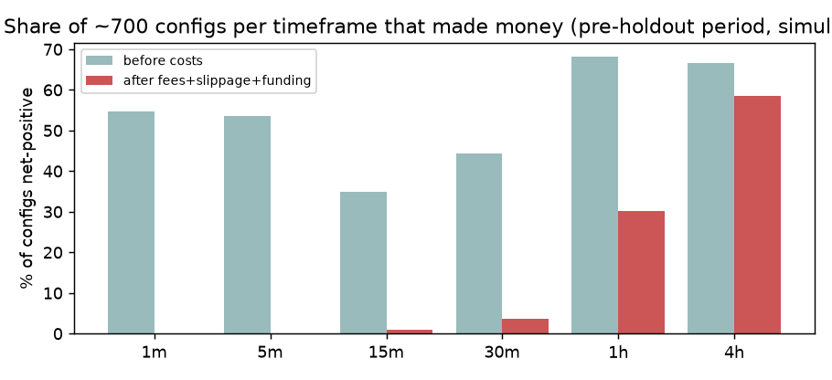
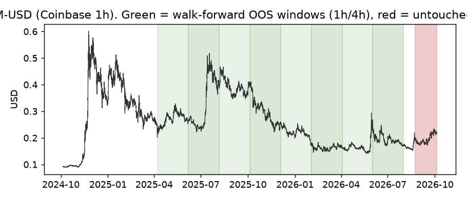

# Quasaria perps desks — strategy research (backtest / simulated only)

*Prepared for Robert Walker, Oct 04, 2026. Branch `strat/research`. **Update, Oct 4 2026, 3:32 PM MST:** the owner approved going live on **testnet only** (test funds, no mainnet). The oracle fix, the slower desk settings and the liquidity-pocket experiment are now running on testnet; see §11–§13. Sections 1–10 are the original research. All figures are **simulated backtests on historical XLM-USD prices**; they are not forecasts and imply no future returns.*

## 1. Headline

**No configuration we tested is robustly net-profitable out-of-sample after realistic vault costs.** We evaluated **4,196 parameter configurations** (11 strategy families × 6 timeframes, 1m → 4h) plus the 10 current demo/fleet desk configs and 36 published-default checks, on up to 2 years of real XLM-USD data, using walk-forward optimisation and a final untouched holdout (2026-08-23 → 2026-10-04, 42 days).

* **Sub-30-minute frames (where the Active demo desks run) are structurally unprofitable:** only 0% (1m), 0.1% (5m) and 0.9% (15m) of configs made money after costs, while ~35–55% were positive *before* costs — i.e. roughly coin-flip signals, and the ~0.2% round-trip cost (10 bps open fee + 2 × 5 bps slippage; the vault has no close fee) is 1.6× a typical 1-minute bar range and ~3× a 15-second bar range.
* **All six current Active desk configs lose money out-of-sample and in the holdout** (in 22 of 23 OOS windows; the exception is one +$14 Regal window) (e.g. Vega 5m trend −$239 over 90 OOS days and −$168 in the 42-day holdout on a $500 desk).
* **Positive walk-forward results are almost all 30m–4h trend/momentum** (12 of 65 family×frame combos positive OOS; the sizeable ones are 1h/4h Turtle, TSMOM, Supertrend and trend), but for **all eight top candidates** the profit comes from one or two trending windows (Jul-2025 and May-2026 XLM rallies): removing the single best window turns all of them negative, none survives a multiple-testing correction (deflated-Sharpe probability ≈ 0), and **all eight top walk-forward candidates lost money on the untouched holdout** (−$1 to −$77).
* Closest-to-viable, *unconfirmed*: the textbook **Supertrend 10×3 on 1h** (no optimisation): +$316 over 480 OOS days (238 trades, PF 1.54, p = 0.005 vs random entries) but **−$6.9 on the holdout** (21 trades); and the **existing fleet 4h trend default** (+$165 OOS, −$36 holdout, 9 trades / 0 wins). These are candidates for forward paper-trading, not for claims of profitability.
* **Security finding (not a strategy):** because the vault fills at the oracle price, if the oracle updates only every ≥2 minutes anyone watching the live market can open when the market is >0.25% away from the stale oracle and close at the next update: simulated +12–16 bps per trade net of all costs with a 64–77% win rate (+39–59 bps at a 0.5% gap). This is an **oracle-latency vulnerability** of the vault and should be fixed, not exploited (§8).

**Recommendation:** do not present any desk as profitable. If the demo should lose less, move desks to 1h/4h frames (cost drag ~0.1–0.2 ATR instead of 1.6–3 ATR) and retire the skew proxy; see §9 for proposed per-desk settings (research proposal only — not applied).

## 2. Data

* **Coinbase Exchange public candles, XLM-USD** (cached under `data/`): 1m: 64,801 bars 2026-08-20 → 2026-10-04, 5m: 57,601 bars 2026-03-18 → 2026-10-04, 15m: 38,401 bars 2025-08-30 → 2026-10-04, 30m: 19,200 bars 2025-08-30 → 2026-10-04, 1h: 17,521 bars 2024-10-04 → 2026-10-04, 4h: 4,379 bars 2024-10-05 → 2026-10-04. Missing minutes (no trades) forward-filled.
* **Funding:** Kraken Futures PF_XLMUSD hourly funding history (2025-10-01 → 2026-10-04, 8,840 hours) applied to open positions, capped at the vault's 0.05 %/h. Mean −0.0002 %/h, 95th percentile |0.004 %/h| — economically negligible, so there is no funding carry to harvest and the "skew proxy" desks are not funding strategies. Binance and Bybit public APIs are geo-blocked from the research box; OKX (8-hourly) was reachable but not needed.
* **15s / 30s frames:** no sub-minute history is cached (Coinbase only gives sub-minute data via raw trades, ~hours deep). Echo/Halo (15s/30s mean-rev) are therefore evaluated at 1m with their Active parameters. Costs relative to bar size are 2–3× *worse* at 15s/30s than at 1m (table in §7), so 1m results are an optimistic bound.

## 3. Backtester and parity with the fleet

`research/engine.py` is a numba event-driven single-desk simulator that mirrors `frontend/src/lib/demo/engine.ts` and `bot/src/office/{sizing,risk}.ts`: decisions on closed bars at the close (= oracle price); entry fill = price ± 5 bps; 10 bps open fee on notional; **no close fee** (verified in `contracts/leverage-vault`: only `open_fee_bps`); exits ± 5 bps, take-profit exact; stop first if stop and target are hit in the same bar; gap through a stop fills at the bar open (more conservative than the demo); stop clamped to 0.8–7.5 %; stop-distance sizing with 0.25 % fee buffer, 1–2 % risk (fleet: trend/mean-rev 1 %, funding desks 0.75 %), 1.5× equity notional cap, 25 % margin cap, desk leverage caps (5×/4×/3×), half-liquidation-distance rule, 10-unit minimum margin; desk gates kept: 3 % daily loss, 10 % drawdown halt (+flatten), 5-loss 4 h pause, 6 entries/desk/24 h, max 2 open. Research-only modelling choice: after a 10 % drawdown halt the desk is reset by an "operator" after 7 days (halts are counted in the tables). Not modelled: fleet-wide caps (a single desk at 1 % risk does not bind them), drift halts, oracle-stale entry blocks.

**Parity vs the real TypeScript demo engine** (same cached 3-day window, 1m stepping, $500 single desk; `frontend/scripts/parity-backtest.ts` drives the actual `step()`):

| desk   |   ts_trades |   py_trades |   same_entry_time |   ts_net |   py_net |
|:-------|------------:|------------:|------------------:|---------:|---------:|
| vega   |          18 |          18 |                18 |   -25.48 |   -29.58 |
| rigel  |          16 |          15 |                12 |   -28.97 |   -32.32 |
| lyra   |          18 |          18 |                18 |   -12.59 |   -12.59 |
| nova   |          18 |          18 |                18 |   -15.23 |   -15.23 |

Lyra and Nova match exactly (same 18 entries, identical P&L). Vega has identical entries; the P&L gap most likely comes from the fleet-level gross-notional cap that trims the second concurrent position in the TS engine (not modelled for a single desk). Regal differs on 4 entries because the TS indicators are recomputed on a 300-bar rolling window (EMA/ATR seeding) while the Python engine uses the full series. Conclusion: same signals, same costs, same sizing; differences are second-order and do not change any conclusion. (The original `active-backtest.ts` runs all six desks on a $500 *total* demo, i.e. ~$83/desk; this study uses **$500 per desk** as requested.)

## 4. Method (and how we limited over-fitting)

1. **Walk-forward:** 1m: IS 12 d / OOS 6 d / step 6 d, 3 windows; 5m: IS 60 d / OOS 30 d / step 30 d, 3 windows; 15m/30m: IS 120 d / OOS 45 d / step 45 d, 5 windows; 1h/4h: IS 180 d / OOS 60 d / step 60 d, 8 windows. In each window the config with the best in-sample net P&L (≥ 8 trades) is chosen and then run on the next, unseen window. The stitched out-of-sample (OOS) result is the headline; in-sample numbers are shown only for contrast.
2. **Untouched holdout:** the last 42 days (2026-08-23 → 2026-10-04; 10 days for 1m) were never used for selection. For each family×frame we picked the best config on all pre-holdout data and ran it once on the holdout; for the top candidates we also ran the config chosen in the most recent walk-forward window.
3. **Multiple testing:** 4,196 grid configs + 10 baselines (grids fixed before looking at results; every one counted). Checks: (a) **random-entry control** — same exits, stops, sizing and costs, random entry times and sides, same trade count, 300 runs per candidate → p-value; (b) **deflated Sharpe ratio** (Bailey & López de Prado) with N = 65 walk-forward trials; (c) **window concentration** — OOS P&L with the single best window removed; (d) **cost stress** — slippage 10 bps instead of 5.
4. **Zero-degree-of-freedom check:** published default parameters (Turtle 20/10, Supertrend 10×3, MACD 12/26/9, etc.) run unchanged — no optimisation, so no selection bias for those specific rules.
5. Families explored: the fleet trend, mean-reversion and skew-proxy strategies (with wider stops, R-multiple targets, ADX trend/range regime filters, trailing exits, fewer trades), plus the sourced strategies in §6. Maker-style fills are **not** assumed (the vault is a taker at oracle price).

## 5. Results

### 5.1 Current demo / fleet desk configs (no optimisation)

| desk config                                 | tf   |   OOS trades |   OOS net $ |   OOS win % |   pre-HO trades |   pre-HO net $ |   pre-HO PF |   pre-HO DD % |   10% halts |   pre-HO net $ before costs |   HO trades |   HO net $ |   HO win % |   HO DD % |
|:--------------------------------------------|:-----|-------------:|------------:|------------:|----------------:|---------------:|------------:|--------------:|------------:|----------------------------:|------------:|-----------:|-----------:|----------:|
| echo (Active 15s mean-rev, evaluated at 1m) | 1m   |        108.0 |       -92.4 |        43.0 |             101 |          -95.8 |         0.1 |          19.2 |           2 |                        10.5 |          60 |      -48.0 |       37.0 |       9.8 |
| echo (fleet 15m mean-rev)                   | 15m  |         36.0 |       -29.8 |        44.0 |              55 |          -39.8 |         0.7 |          11.6 |           1 |                         4.7 |           5 |       -0.4 |       60.0 |       1.9 |
| halo (Active 30s mean-rev, evaluated at 1m) | 1m   |        108.0 |      -100.3 |        31.0 |             108 |          -96.1 |         0.2 |          19.2 |           2 |                        20.2 |          47 |      -50.0 |       36.0 |      10.3 |
| halo (fleet 1h mean-rev)                    | 1h   |         22.0 |       -52.6 |        18.0 |              28 |           -5.4 |         0.9 |          10.3 |           1 |                         0.7 |           1 |        0.7 |      100.0 |       0.5 |
| lyra (Active 1m skew proxy)                 | 1m   |        108.0 |       -93.3 |        14.0 |             141 |          -78.3 |         0.1 |          16.0 |           1 |                         1.0 |          60 |      -30.5 |       27.0 |       6.7 |
| nova (Active 30m skew proxy)                | 30m  |        847.0 |      -521.9 |        43.0 |            1324 |         -388.2 |         0.5 |          77.8 |          15 |                        53.3 |         147 |     -100.7 |       44.0 |      20.7 |
| regal (Active 15m trend)                    | 15m  |        666.0 |      -497.7 |        24.0 |             942 |         -416.4 |         0.5 |          84.1 |          25 |                      -130.7 |         114 |     -100.3 |       26.0 |      21.4 |
| regal (fleet 4h trend)                      | 4h   |        123.0 |       191.0 |        30.0 |             155 |          556.4 |         1.9 |          24.2 |           6 |                       610.2 |           9 |      -36.2 |        0.0 |       7.4 |
| vega (Active 5m trend)                      | 5m   |        313.0 |      -238.5 |        22.0 |             539 |         -279.0 |         0.5 |          56.3 |           9 |                       -80.5 |         125 |     -168.0 |       13.0 |      33.9 |
| vega (fleet 1h trend)                       | 1h   |        417.0 |       -60.2 |        30.0 |             572 |          191.0 |         1.1 |          49.0 |          17 |                       875.9 |          35 |      -36.2 |       29.0 |      10.1 |

Every Active (15s–30m) config loses in OOS (22 of 23 windows) and in the holdout; most lose even before costs or barely break even before costs. The fleet's own 4h trend default was positive pre-holdout (driven by the Nov-2024 and Jul-2025 rallies) but lost in the holdout.



### 5.2 Walk-forward OOS, every family × frame (best IS config re-selected each window)

| frame   | family     |   trades |   win |   avg R |   OOS net $ |   PF |   max DD % |   +windows |   windows |   halts |   IS net $ (selected) |
|:--------|:-----------|---------:|------:|--------:|------------:|-----:|-----------:|-----------:|----------:|--------:|----------------------:|
| 1h      | turtle     |    415.0 |  27.0 |     0.2 |       382.0 |  1.3 |       24.2 |        4.0 |       8.0 |    16.0 |                2233.3 |
| 30m     | tsmom      |    137.0 |  31.0 |     0.3 |       240.0 |  1.6 |       18.0 |        1.0 |       5.0 |     5.0 |                 788.6 |
| 1h      | tsmom      |    300.0 |  34.0 |     0.1 |       145.8 |  1.2 |       20.6 |        3.0 |       8.0 |    10.0 |                2286.9 |
| 4h      | supertrend |     75.0 |  37.0 |     0.3 |       112.9 |  1.9 |        5.4 |        3.0 |       8.0 |     0.0 |                 385.7 |
| 4h      | tsmom      |     86.0 |  36.0 |     0.2 |        70.3 |  1.3 |        8.8 |        3.0 |       8.0 |     0.0 |                1452.7 |
| 1h      | supertrend |    212.0 |  37.0 |     0.0 |        50.6 |  1.1 |        9.8 |        4.0 |       8.0 |     0.0 |                1027.3 |
| 4h      | trend      |    133.0 |  37.0 |     0.1 |        43.5 |  1.2 |        7.6 |        3.0 |       8.0 |     0.0 |                1650.7 |
| 15m     | skewproxy  |    350.0 |  42.0 |     0.0 |        27.2 |  1.1 |        5.9 |        2.0 |       5.0 |     0.0 |                  12.7 |
| 15m     | macross    |     97.0 |  29.0 |     0.0 |        15.1 |  1.1 |       14.0 |        1.0 |       5.0 |     1.0 |                 111.2 |
| 5m      | keltner    |    218.0 |  27.0 |     0.0 |         8.6 |  1.0 |       21.9 |        2.0 |       3.0 |     7.0 |                 216.5 |
| 1m      | tsmom      |     58.0 |  21.0 |     0.1 |         8.4 |  1.1 |       10.1 |        1.0 |       3.0 |     3.0 |                 -73.6 |
| 30m     | macross    |     87.0 |  25.0 |     0.0 |         7.3 |  1.0 |        9.9 |        2.0 |       5.0 |     0.0 |                 179.0 |
| 15m     | tsmom      |    211.0 |  35.0 |     0.0 |        -1.8 |  1.0 |       16.7 |        2.0 |       5.0 |     7.0 |                 317.0 |
| 1h      | skewproxy  |    211.0 |  52.0 |    -0.0 |        -2.7 |  1.0 |        9.3 |        5.0 |       8.0 |     0.0 |                 337.4 |
| 1m      | orb        |     18.0 |  39.0 |    -0.1 |        -8.9 |  0.8 |        4.3 |        1.0 |       3.0 |     0.0 |                  -4.7 |
| 1h      | macross    |     78.0 |  31.0 |    -0.0 |        -9.3 |  0.9 |        5.8 |        4.0 |       8.0 |     0.0 |                1314.8 |
| 30m     | supertrend |     81.0 |  31.0 |    -0.0 |        -9.9 |  0.9 |        6.7 |        2.0 |       5.0 |     0.0 |                 226.0 |
| 4h      | turtle     |     80.0 |  30.0 |    -0.0 |       -13.0 |  0.9 |       10.2 |        3.0 |       8.0 |     1.0 |                1370.8 |
| 30m     | orb        |    188.0 |  41.0 |    -0.0 |       -14.9 |  1.0 |        7.8 |        2.0 |       5.0 |     0.0 |                  -3.9 |
| 5m      | orb        |     66.0 |  33.0 |    -0.1 |       -17.8 |  0.8 |        7.1 |        1.0 |       3.0 |     0.0 |                  27.7 |
| 4h      | keltner    |    142.0 |  31.0 |    -0.0 |       -19.2 |  0.9 |       10.2 |        3.0 |       8.0 |     1.0 |                1764.3 |
| 4h      | skewproxy  |     91.0 |  31.0 |    -0.1 |       -21.3 |  0.9 |        6.9 |        3.0 |       8.0 |     0.0 |                 425.1 |
| 1m      | skewproxy  |    108.0 |  27.0 |    -0.1 |       -21.5 |  0.3 |        2.0 |        0.0 |       3.0 |     0.0 |                 -32.5 |
| 4h      | rsi2       |    106.0 |  58.0 |    -0.0 |       -22.4 |  0.8 |        6.8 |        5.0 |       8.0 |     0.0 |                  46.0 |
| 15m     | bbmr       |     34.0 |  50.0 |    -0.1 |       -23.5 |  0.7 |        4.0 |        1.0 |       5.0 |     0.0 |                  34.3 |
| 4h      | macd       |     94.0 |  30.0 |    -0.1 |       -31.7 |  0.8 |        6.2 |        3.0 |       8.0 |     0.0 |                 248.6 |
| 1m      | bbmr       |     47.0 |  49.0 |    -0.2 |       -39.8 |  0.5 |        4.1 |        0.0 |       3.0 |     0.0 |                 -50.2 |
| 30m     | rsi2       |    262.0 |  51.0 |    -0.0 |       -40.2 |  0.6 |        4.3 |        1.0 |       5.0 |     0.0 |                 -89.5 |
| 4h      | bbmr       |     61.0 |  33.0 |    -0.1 |       -42.8 |  0.8 |        6.8 |        2.0 |       8.0 |     0.0 |                 298.6 |
| 4h      | macross    |     50.0 |  34.0 |    -0.2 |       -43.8 |  0.6 |        4.5 |        2.0 |       8.0 |     0.0 |                 300.6 |
| 30m     | trend      |    222.0 |  28.0 |    -0.1 |       -57.1 |  0.8 |       13.8 |        2.0 |       5.0 |     2.0 |                 231.3 |
| 30m     | bbmr       |     74.0 |  38.0 |    -0.2 |       -60.4 |  0.7 |       10.1 |        1.0 |       5.0 |     1.0 |                  56.5 |
| 5m      | turtle     |    210.0 |  29.0 |    -0.1 |       -69.1 |  0.9 |       23.7 |        1.0 |       3.0 |     7.0 |                 -16.2 |
| 1m      | trend      |    108.0 |  23.0 |    -0.1 |       -73.4 |  0.4 |        7.7 |        0.0 |       3.0 |     0.0 |                -100.3 |
| 1m      | supertrend |     98.0 |  32.0 |    -0.2 |       -77.0 |  0.5 |        9.7 |        0.0 |       3.0 |     0.0 |                 -89.2 |
| 5m      | trend      |    273.0 |  25.0 |    -0.1 |       -77.9 |  0.8 |       19.4 |        1.0 |       3.0 |     6.0 |                 133.9 |
| 1h      | rsi2       |    391.0 |  54.0 |    -0.0 |       -80.4 |  0.6 |        4.3 |        0.0 |       8.0 |     0.0 |                 -95.3 |
| 1m      | turtle     |    108.0 |  22.0 |    -0.2 |       -87.6 |  0.4 |        8.1 |        0.0 |       3.0 |     0.0 |                -125.1 |
| 5m      | skewproxy  |    476.0 |  34.0 |    -0.1 |       -88.6 |  0.5 |        7.8 |        0.0 |       3.0 |     0.0 |                -108.4 |
| 5m      | supertrend |    101.0 |  29.0 |    -0.2 |       -91.2 |  0.5 |       13.2 |        1.0 |       3.0 |     1.0 |                -188.2 |
| 15m     | orb        |    197.0 |  37.0 |    -0.1 |       -91.5 |  0.8 |       10.5 |        0.0 |       5.0 |     1.0 |                 -10.9 |
| 1m      | keltner    |    108.0 |  21.0 |    -0.2 |       -96.4 |  0.3 |        8.7 |        0.0 |       3.0 |     0.0 |                -100.5 |
| 5m      | macross    |    108.0 |  25.0 |    -0.2 |      -100.2 |  0.7 |       16.0 |        1.0 |       3.0 |     3.0 |                  21.6 |
| 1m      | rsi2       |    108.0 |   9.0 |    -0.2 |      -101.1 |  0.0 |        8.5 |        0.0 |       3.0 |     0.0 |                -146.4 |
| 1m      | macd       |    108.0 |  14.0 |    -0.2 |      -102.9 |  0.2 |        8.1 |        0.0 |       3.0 |     0.0 |                -145.4 |
| 15m     | rsi2       |    490.0 |  48.0 |    -0.0 |      -104.9 |  0.5 |        8.7 |        0.0 |       5.0 |     0.0 |                -279.6 |
| 1h      | macd       |    421.0 |  31.0 |    -0.1 |      -106.2 |  0.8 |       14.6 |        4.0 |       8.0 |     2.0 |                 159.7 |
| 1m      | macross    |     85.0 |  15.0 |    -0.3 |      -112.5 |  0.2 |       10.3 |        0.0 |       3.0 |     1.0 |                 -96.3 |
| 1h      | keltner    |    389.0 |  30.0 |    -0.1 |      -118.1 |  0.9 |       20.6 |        2.0 |       8.0 |    12.0 |                1952.5 |
| 5m      | bbmr       |    111.0 |  48.0 |    -0.2 |      -118.8 |  0.5 |       12.0 |        0.0 |       3.0 |     1.0 |                  53.7 |
| 30m     | skewproxy  |    342.0 |  45.0 |    -0.1 |      -123.5 |  0.7 |       17.1 |        0.0 |       5.0 |     2.0 |                  18.5 |
| 30m     | macd       |    398.0 |  27.0 |    -0.1 |      -133.7 |  0.7 |       14.8 |        1.0 |       5.0 |     2.0 |                -160.5 |
| 15m     | supertrend |    137.0 |  26.0 |    -0.2 |      -134.2 |  0.5 |       18.5 |        1.0 |       5.0 |     2.0 |                -116.9 |
| 5m      | tsmom      |    194.0 |  24.0 |    -0.1 |      -141.5 |  0.7 |       26.2 |        0.0 |       3.0 |     8.0 |                 256.8 |
| 1h      | orb        |    403.0 |  36.0 |    -0.1 |      -145.3 |  0.9 |       17.2 |        2.0 |       8.0 |     7.0 |                 -38.3 |
| 5m      | rsi2       |    374.0 |  34.0 |    -0.1 |      -160.2 |  0.3 |       15.4 |        0.0 |       3.0 |     2.0 |                -266.2 |
| 30m     | turtle     |    242.0 |  31.0 |    -0.1 |      -168.0 |  0.7 |       19.5 |        2.0 |       5.0 |     7.0 |                 215.0 |
| 5m      | macd       |    366.0 |  25.0 |    -0.1 |      -206.4 |  0.5 |       19.2 |        0.0 |       3.0 |     4.0 |                -338.7 |
| 1h      | trend      |    313.0 |  28.0 |    -0.1 |      -207.4 |  0.7 |       17.8 |        2.0 |       8.0 |     8.0 |                1366.4 |
| 30m     | keltner    |    180.0 |  22.0 |    -0.3 |      -222.7 |  0.5 |       24.4 |        1.0 |       5.0 |     4.0 |                 297.7 |
| 1h      | bbmr       |    181.0 |  38.0 |    -0.3 |      -229.8 |  0.6 |       15.6 |        0.0 |       8.0 |     2.0 |                 214.6 |
| 15m     | turtle     |    265.0 |  26.0 |    -0.2 |      -249.8 |  0.6 |       23.1 |        1.0 |       5.0 |    11.0 |                 150.6 |
| 15m     | macd       |    656.0 |  23.0 |    -0.1 |      -273.4 |  0.5 |       19.1 |        0.0 |       5.0 |     5.0 |                -553.0 |
| 15m     | trend      |    335.0 |  26.0 |    -0.2 |      -276.9 |  0.6 |       32.1 |        2.0 |       5.0 |     9.0 |                  65.4 |
| 15m     | keltner    |    302.0 |  23.0 |    -0.2 |      -335.9 |  0.6 |       24.2 |        0.0 |       5.0 |    12.0 |                 -18.8 |

**"Pick the best of everything" walk-forward** (each window the optimiser may choose any family on that frame — the most honest summary of the whole search):

| frame   |   trades |   OOS net $ |   PF |   +windows |   windows | family picked each window                                   |
|:--------|---------:|------------:|-----:|-----------:|----------:|:------------------------------------------------------------|
| 1m      |     19.0 |       -25.1 |  0.6 |        0.0 |       3.0 | bbmr; orb; orb                                              |
| 5m      |    182.0 |       -77.8 |  0.8 |        1.0 |       3.0 | tsmom; tsmom; keltner                                       |
| 15m     |    169.0 |      -125.4 |  0.7 |        1.0 |       5.0 | bbmr; tsmom; tsmom; tsmom; turtle                           |
| 30m     |    169.0 |       333.4 |  1.8 |        2.0 |       5.0 | turtle; turtle; keltner; tsmom; tsmom                       |
| 1h      |    373.0 |        17.7 |  1.0 |        3.0 |       8.0 | macross; tsmom; turtle; tsmom; turtle; tsmom; bbmr; keltner |
| 4h      |    108.0 |       -81.5 |  0.7 |        3.0 |       8.0 | keltner; skewproxy; trend; trend; trend; bbmr; bbmr; trend  |

### 5.3 Robustness of the top walk-forward candidates

| tf   | family     |   WF OOS $ | +windows   |   OOS $ w/o best window |   p vs random |   random median $ |   Sharpe (ann.) |   DSR prob |   OOS $ @10bp slip |   OOS $ no costs |   HO trades |   HO net $ |   HO win |   HO DD % | config used on holdout                                                                                                                  |
|:-----|:-----------|-----------:|:-----------|------------------------:|--------------:|------------------:|----------------:|-----------:|-------------------:|-----------------:|------------:|-----------:|---------:|----------:|:----------------------------------------------------------------------------------------------------------------------------------------|
| 1h   | turtle     |     382.00 | 4/8        |                 -271.20 |          0.08 |            167.50 |            0.70 |       0.00 |             250.10 |           560.60 |          39 |     -77.40 |    18.00 |     17.70 | {"n_in": 20, "n_out": 10, "stopN": 2, "trail": "none"}                                                                                  |
| 30m  | tsmom      |     240.00 | 1/5        |                 -188.30 |          0.01 |            -15.20 |            1.00 |       0.00 |             226.70 |           289.00 |          15 |     -32.00 |    20.00 |     10.60 | {"H": 48, "L": 168, "stopAtr": 3, "trailAtr": 0}                                                                                        |
| 1h   | tsmom      |     145.80 | 3/8        |                  -79.30 |          0.09 |             16.70 |            0.63 |       0.00 |              95.50 |           278.20 |          21 |     -50.00 |    14.00 |     11.30 | {"H": 12, "L": 168, "stopAtr": 3, "trailAtr": 0}                                                                                        |
| 4h   | supertrend |     112.90 | 3/8        |                  -13.90 |          0.08 |              1.20 |            1.14 |       0.00 |             105.00 |           128.70 |           2 |      -1.30 |    50.00 |      1.10 | {"adx_min": 25, "m": 2, "n": 20}                                                                                                        |
| 4h   | tsmom      |      70.30 | 3/8        |                  -48.40 |          0.10 |            -16.10 |            0.50 |       0.00 |              62.80 |            72.20 |           5 |     -13.00 |     0.00 |      3.90 | {"H": 12, "L": 500, "stopAtr": 3, "trailAtr": 4}                                                                                        |
| 1h   | supertrend |      50.60 | 4/8        |                  -42.90 |          0.04 |            -46.60 |            0.72 |       0.00 |               5.60 |           111.40 |          21 |      -6.90 |    38.00 |      3.90 | {"adx_min": 0, "m": 3, "n": 10}                                                                                                         |
| 4h   | trend      |      43.50 | 3/8        |                  -32.40 |          0.07 |            -17.10 |            0.49 |       0.00 |              47.50 |            70.60 |          16 |     -39.40 |     6.00 |      8.10 | {"adx_min": 0, "breakout": 20, "fast": 9, "slow": 21, "stopAtr": 2, "tpR": 0, "trailAtr": 3}                                            |
| 15m  | skewproxy  |      27.20 | 2/5        |                  -19.50 |          0.00 |            -71.40 |            1.04 |       0.00 |             -18.30 |           105.80 |          41 |     -18.80 |    27.00 |      4.10 | {"N": 20, "dir": 1, "exitRate": 2e-05, "maxHoldBars": 30, "maxRet": 1.2, "minRate": 0.0001, "minSkew": 10000, "stopPct": 3, "tpPct": 4} |

Reading: "OOS $ w/o best window" is negative for all eight; "p vs random" ≤ 0.05 only for 30m TSMOM (one positive window out of five), 1h Supertrend and the 15m with-flow skew-proxy variant (random 15m entries bleed costs, so beating them is easy; the variant itself is only +$27 and turns negative at 10 bps slippage) — none of which survives a correction for ~65 trials (Bonferroni threshold ≈ 0.0008); deflated-Sharpe probability ≈ 0 for all (the expected best Sharpe from 65 no-skill trials is ≈ 6.6 annualised on this sample, far above any candidate's). **All eight lost money on the holdout.**

### 5.4 Holdout: best pre-holdout config per family × frame, run once on the last 42 days

| frame   | family     |   pre-HO trades |   pre-HO net $ (in-sample!) |   pre-HO PF |   HO trades |   HO net $ |   HO win |   HO DD % |
|:--------|:-----------|----------------:|----------------------------:|------------:|------------:|-----------:|---------:|----------:|
| 4h      | keltner    |           142.0 |                      1751.9 |         3.2 |         9.0 |      -28.9 |      0.0 |       5.9 |
| 1h      | keltner    |           479.0 |                      1560.6 |         1.6 |        31.0 |      -47.7 |     19.0 |      13.1 |
| 1h      | turtle     |           594.0 |                      1342.4 |         1.3 |        39.0 |      -77.4 |     18.0 |      17.7 |
| 4h      | trend      |            85.0 |                      1295.7 |         4.8 |         2.0 |       -4.0 |      0.0 |       0.9 |
| 4h      | turtle     |           132.0 |                      1274.6 |         2.8 |         9.0 |      -22.9 |     11.0 |       5.5 |
| 1h      | tsmom      |           312.0 |                      1026.1 |         1.6 |        21.0 |      -50.0 |     14.0 |      11.3 |
| 1h      | macross    |            78.0 |                      1017.1 |         3.3 |         5.0 |       -2.7 |     40.0 |       3.1 |
| 4h      | tsmom      |           115.0 |                      1000.6 |         2.5 |         7.0 |      -30.1 |      0.0 |       7.1 |
| 4h      | macross    |            46.0 |                       660.9 |         4.1 |         2.0 |       -7.0 |      0.0 |       2.2 |
| 4h      | supertrend |            43.0 |                       621.5 |         4.9 |         2.0 |       -5.2 |      0.0 |       1.3 |
| 1h      | trend      |           455.0 |                       606.5 |         1.3 |        29.0 |      -29.9 |     21.0 |      10.2 |
| 30m     | tsmom      |           148.0 |                       531.6 |         1.9 |        15.0 |      -32.0 |     20.0 |      10.6 |
| 1h      | supertrend |           303.0 |                       415.3 |         1.5 |        21.0 |       -6.9 |     38.0 |       3.9 |
| 30m     | macross    |            98.0 |                       118.1 |         1.5 |        18.0 |       -6.7 |     28.0 |       5.8 |
| 30m     | keltner    |           455.0 |                        90.4 |         1.1 |        49.0 |      -60.7 |     31.0 |      14.8 |
| 30m     | supertrend |           117.0 |                        83.1 |         1.4 |        13.0 |       -3.5 |     31.0 |       3.8 |
| 30m     | trend      |           165.0 |                        70.5 |         1.2 |        23.0 |      -74.4 |      9.0 |      15.4 |
| 4h      | bbmr       |            50.0 |                        56.4 |         1.5 |         0.0 |        0.0 |    nan   |       0.0 |
| 4h      | macd       |            24.0 |                        40.1 |         2.5 |         0.0 |        0.0 |    nan   |       0.0 |
| 4h      | skewproxy  |            68.0 |                        36.5 |         1.2 |         0.0 |        0.0 |    nan   |       0.0 |
| 1h      | bbmr       |            26.0 |                        20.4 |         1.2 |         1.0 |        6.3 |    100.0 |       0.5 |
| 15m     | skewproxy  |           531.0 |                        19.7 |         1.0 |        41.0 |      -18.8 |     27.0 |       4.1 |
| 5m      | trend      |           311.0 |                        18.9 |         1.0 |        81.0 |     -119.0 |     19.0 |      24.3 |
| 15m     | macross    |            85.0 |                        10.2 |         1.1 |        15.0 |       -6.2 |     40.0 |       5.3 |
| 1h      | macd       |           473.0 |                         4.7 |         1.0 |        29.0 |       -6.3 |     34.0 |       3.0 |
| 30m     | turtle     |           312.0 |                         3.5 |         1.0 |        31.0 |      -32.2 |     26.0 |      10.8 |
| 15m     | bbmr       |            48.0 |                         0.6 |         1.0 |         4.0 |        6.7 |    100.0 |       0.6 |
| 4h      | rsi2       |            88.0 |                         0.2 |         1.0 |         6.0 |        2.1 |     83.0 |       0.8 |
| 5m      | orb        |           121.0 |                        -1.3 |         1.0 |        41.0 |      -28.0 |     41.0 |       8.1 |
| 1m      | tsmom      |            98.0 |                        -6.2 |         1.0 |        20.0 |      -17.4 |     15.0 |      10.1 |
| 30m     | bbmr       |            43.0 |                        -6.5 |         0.9 |         2.0 |       -0.0 |     50.0 |       1.0 |
| 5m      | bbmr       |            71.0 |                       -13.2 |         0.9 |        19.0 |      -25.0 |     32.0 |       6.1 |
| 1m      | orb        |            30.0 |                       -19.8 |         0.7 |        10.0 |       -9.1 |     40.0 |       3.9 |
| 15m     | tsmom      |           280.0 |                       -25.8 |         1.0 |        38.0 |     -101.9 |     18.0 |      23.3 |
| 1h      | skewproxy  |           340.0 |                       -28.0 |         0.9 |         9.0 |       -9.9 |     56.0 |       3.1 |
| 5m      | keltner    |           382.0 |                       -31.5 |         1.0 |       107.0 |     -138.6 |     30.0 |      32.2 |
| 5m      | macross    |           125.0 |                       -35.0 |         0.7 |        36.0 |      -34.9 |     14.0 |       7.0 |
| 1m      | bbmr       |            52.0 |                       -36.1 |         0.5 |        26.0 |      -25.7 |     38.0 |       7.7 |
| 1m      | macross    |            65.0 |                       -37.4 |         0.7 |        26.0 |      -43.2 |     31.0 |      10.1 |
| 1m      | skewproxy  |           180.0 |                       -37.5 |         0.1 |        60.0 |      -17.3 |     10.0 |       3.5 |
| 30m     | skewproxy  |           355.0 |                       -41.9 |         0.8 |        14.0 |       -6.8 |     64.0 |       3.0 |
| 1m      | supertrend |           139.0 |                       -43.3 |         0.7 |        37.0 |      -47.3 |     16.0 |      10.1 |
| 15m     | turtle     |           301.0 |                       -46.3 |         0.9 |        41.0 |      -52.6 |     22.0 |      16.2 |
| 1m      | trend      |            95.0 |                       -49.5 |         0.6 |        26.0 |      -29.8 |     19.0 |      10.2 |
| 5m      | tsmom      |           139.0 |                       -52.7 |         0.9 |        42.0 |       19.5 |     33.0 |      13.1 |
| 1h      | rsi2       |           293.0 |                       -52.8 |         0.6 |        17.0 |        4.0 |     76.0 |       0.8 |
| 5m      | turtle     |           197.0 |                       -55.2 |         0.9 |        56.0 |     -129.3 |     18.0 |      26.9 |
| 1m      | turtle     |           138.0 |                       -56.4 |         0.6 |        37.0 |      -50.1 |     14.0 |      10.0 |
| 1m      | keltner    |           136.0 |                       -57.7 |         0.6 |        25.0 |      -50.5 |      4.0 |      10.1 |
| 30m     | orb        |           279.0 |                       -76.2 |         0.8 |        38.0 |      -29.8 |     39.0 |       7.6 |
| 15m     | keltner    |           374.0 |                       -80.2 |         0.9 |        29.0 |      -58.9 |     24.0 |      12.7 |
| 15m     | trend      |           370.0 |                       -81.4 |         0.9 |        44.0 |      -24.0 |     32.0 |       8.9 |
| 30m     | rsi2       |           425.0 |                       -84.2 |         0.6 |        44.0 |      -20.5 |     50.0 |       4.9 |
| 1m      | macd       |           138.0 |                       -87.7 |         0.4 |        51.0 |      -47.2 |     20.0 |      10.1 |
| 15m     | orb        |           284.0 |                       -94.3 |         0.8 |        37.0 |      -34.1 |     30.0 |       9.2 |
| 1m      | rsi2       |           114.0 |                       -95.3 |         0.0 |        39.0 |      -50.6 |      3.0 |      10.1 |
| 5m      | skewproxy  |           552.0 |                       -98.0 |         0.6 |       132.0 |      -47.7 |     32.0 |      10.4 |
| 15m     | supertrend |           153.0 |                      -100.2 |         0.7 |        10.0 |      -16.3 |     10.0 |       5.9 |
| 30m     | macd       |           564.0 |                      -112.7 |         0.8 |        75.0 |      -40.7 |     23.0 |       8.7 |
| 5m      | supertrend |           161.0 |                      -141.5 |         0.5 |        47.0 |      -33.5 |     30.0 |       9.9 |
| 15m     | rsi2       |           740.0 |                      -148.8 |         0.5 |        94.0 |      -24.9 |     57.0 |       5.6 |
| 1h      | orb        |           523.0 |                      -157.9 |         0.8 |        29.0 |      -45.2 |     31.0 |      12.2 |
| 5m      | rsi2       |           553.0 |                      -211.6 |         0.2 |       154.0 |      -81.9 |     30.0 |      16.6 |
| 5m      | macd       |           555.0 |                      -244.1 |         0.4 |       152.0 |     -111.8 |     18.0 |      22.4 |
| 15m     | macd       |           992.0 |                      -283.2 |         0.5 |       123.0 |      -70.4 |     18.0 |      14.7 |

5 of 65 were positive on the holdout, all by ≤ $20 on ≤ 42 trades — consistent with noise. The configs with the largest in-sample profits (+$1,000–1,750 pre-holdout) all lost on the holdout.



## 6. Sourced / published strategies

No third-party code was copied; every strategy was reimplemented from the published rules. Claimed track records (futures in the 1980s–2000s, equities, BTC) were treated as hypotheses and re-tested on XLM with vault costs.

| family     | source                                                                                                                                                                   | url                                                                                                        | license                                                              |
|:-----------|:-------------------------------------------------------------------------------------------------------------------------------------------------------------------------|:-----------------------------------------------------------------------------------------------------------|:---------------------------------------------------------------------|
| trend      | Quasaria fleet trend (bot/src/office/strategies.ts): Donchian breakout + EMA filter, ATR stop/trail, EMA exit                                                            | in-repo                                                                                                    | repo license                                                         |
| bbmr       | Quasaria fleet mean-rev (Bollinger 20/2.2 + RSI extreme + ADX<20, target mid band); Bollinger 'Bollinger on Bollinger Bands' (2001)                                      | in-repo / book                                                                                             | repo license; reimplemented                                          |
| skewproxy  | Quasaria Active skew proxy (candle pressure mapped onto funding strategy)                                                                                                | frontend/src/lib/demo/engine.ts                                                                            | repo license                                                         |
| turtle     | Turtle Trading rules (Dennis/Eckhardt; C. Faith 'Way of the Turtle' 2007; public 'Original Turtle Trading Rules' PDF): 20/55-bar Donchian entry, 10/20-bar exit, 2N stop | https://oxfordstrat.com/coasdfASD32/uploads/2016/01/turtle-rules.pdf                                       | rules (pseudocode) only; reimplemented                               |
| tsmom      | Time-series momentum (Moskowitz, Ooi, Pedersen 2012 JFE 'Time series momentum'; crypto: Liu & Tsyvinski 2021 RFS 'Risks and returns of cryptocurrency')                  | https://doi.org/10.1016/j.jfineco.2011.11.003                                                              | paper; reimplemented                                                 |
| macross    | Dual moving-average crossover / Faber 'A Quantitative Approach to Tactical Asset Allocation' (2007) SMA trend filter                                                     | https://papers.ssrn.com/sol3/papers.cfm?abstract_id=962461                                                 | paper; reimplemented                                                 |
| rsi2       | Connors RSI(2) (Connors & Alvarez 'Short Term Trading Strategies That Work' 2008): RSI2 extreme with 200-SMA filter, exit on 5-SMA cross                                 | book                                                                                                       | rules only; reimplemented                                            |
| keltner    | Keltner/ATR channel breakout (Chester Keltner 1960; L. Raschke ATR variant)                                                                                              | https://school.stockcharts.com/doku.php?id=technical_indicators:keltner_channels                           | public description; reimplemented                                    |
| orb        | Opening-range breakout (Toby Crabel 'Day Trading with Short Term Price Patterns and Opening Range Breakout' 1990) adapted to the 00:00 UTC session of 24h crypto         | book                                                                                                       | rules only; reimplemented                                            |
| macd       | MACD 12/26/9 signal cross (Gerald Appel) with 200-EMA trend filter                                                                                                       | https://school.stockcharts.com/doku.php?id=technical_indicators:moving_average_convergence_divergence_macd | public description; reimplemented                                    |
| supertrend | Supertrend (Olivier Seban) ATR(10)x3 flip with line as trailing stop                                                                                                     | https://www.tradingview.com/support/solutions/43000634738-supertrend/                                      | public description; reimplemented (TradingView built-in, not copied) |
| chandelier | Chandelier exit (Chuck LeBeau): highest high(22) - 3*ATR(22) trail, used as an exit option on breakouts                                                                  | https://school.stockcharts.com/doku.php?id=technical_indicators:chandelier_exit                            | public description; reimplemented                                    |
| lpsweep    | Liquidity sweep + reclaim of swing / equal highs-lows and prior-day high-low (stop-hunt reversal; ICT/'smart money' liquidity concepts, Wyckoff spring/upthrust)         | https://school.stockcharts.com/doku.php?id=market_analysis:the_wyckoff_method                              | public descriptions; reimplemented                                   |
| vpnode     | Volume-profile value-area re-entry toward the POC ('80 % rule', J. Dalton 'Mind over Markets' 1990)                                                                      | book                                                                                                       | rules only; reimplemented                                            |
| random     | Random-entry control: random time + side with each config's own exits/stops/costs                                                                                        | this study                                                                                                 | -                                                                    |

Open-source libraries checked (LICENSE files read 2026-10-04): | repo                           | license                                                  |
|:-------------------------------|:---------------------------------------------------------|
| freqtrade/freqtrade-strategies | GPL-3.0 (not used: incompatible to copy; concepts only)  |
| mementum/backtrader            | GPL-3.0 (not used)                                       |
| kernc/backtesting.py           | AGPL-3.0 (not used)                                      |
| jesse-ai/jesse                 | MIT (permissive; not needed, rules reimplemented)        |
| QuantConnect/Lean              | Apache-2.0 (permissive; not needed, rules reimplemented) |

**Published defaults, unchanged (zero degrees of freedom), OOS period = all walk-forward OOS windows (contiguous), then holdout:**

| strategy                                         | tf   |   days |   trades |   win % |   avg R |   net $ |     PF |   DD % |   Sharpe |   cost share | +windows   |   net w/o best window |   p vs random |   HO trades |   HO win % |   HO net $ |   HO PF |   HO DD % |
|:-------------------------------------------------|:-----|-------:|---------:|--------:|--------:|--------:|-------:|-------:|---------:|-------------:|:-----------|----------------------:|--------------:|------------:|-----------:|-----------:|--------:|----------:|
| tsmom (L=168 bars, H=48)                         | 15m  |    225 |      174 |   37.00 |    0.07 |   53.80 |   1.12 |  16.20 |     0.71 |         0.08 | 2/5        |                -29.50 |          0.16 |          38 |      18.00 |    -101.90 |    0.13 |     23.30 |
| MA cross 50/200 long-only (Faber-style)          | 15m  |    225 |       50 |   24.00 |   -0.11 |  -28.40 |   0.75 |  12.40 |    -0.64 |         0.10 | 2/5        |                -58.70 |          0.67 |          15 |      40.00 |      -6.20 |    0.79 |      5.30 |
| ORB first 2h UTC                                 | 15m  |    225 |      179 |   30.00 |   -0.18 | -142.30 |   0.70 |  32.70 |    -2.37 |         0.12 | 1/5        |               -159.20 |          0.88 |          36 |      28.00 |     -52.70 |    0.54 |     10.50 |
| Keltner 20, 2ATR breakout                        | 15m  |    225 |      390 |   30.00 |   -0.13 | -215.60 |   0.75 |  53.70 |    -2.04 |         0.19 | 1/5        |               -296.90 |          0.62 |          76 |      20.00 |    -120.90 |    0.32 |     30.80 |
| Supertrend 10x3                                  | 15m  |    225 |      367 |   26.00 |   -0.16 | -225.80 |   0.65 |  47.50 |    -3.92 |         0.16 | 0/5        |               -204.50 |          1.00 |          76 |      30.00 |     -61.10 |    0.56 |     12.90 |
| trend (fleet default 20/50/20, 2ATR, 3ATR trail) | 15m  |    225 |      439 |   27.00 |   -0.14 | -242.10 |   0.70 |  54.00 |    -2.53 |         0.21 | 2/5        |               -276.60 |          0.71 |          70 |      13.00 |    -132.20 |    0.22 |     29.80 |
| turtle S2 (55/20, 2N)                            | 15m  |    225 |      276 |   24.00 |   -0.23 | -247.70 |   0.63 |  56.30 |    -2.74 |         0.17 | 1/5        |               -250.50 |          0.97 |          68 |      29.00 |     -88.00 |    0.55 |     22.60 |
| MACD 12/26/9 + EMA200                            | 15m  |    225 |      576 |   24.00 |   -0.13 | -269.00 |   0.61 |  56.70 |    -4.75 |         0.25 | 0/5        |               -255.40 |          0.97 |         119 |      26.00 |     -90.50 |    0.43 |     18.10 |
| Connors RSI(2) <10 / SMA200                      | 15m  |    225 |      786 |   48.00 |   -0.10 | -273.70 |   0.43 |  54.80 |    -8.10 |         0.43 | 0/5        |               -242.40 |          0.91 |         156 |      45.00 |     -90.80 |    0.33 |     18.30 |
| Bollinger 20/2 + RSI35, no ADX                   | 15m  |    225 |      580 |   44.00 |   -0.15 | -297.00 |   0.63 |  63.40 |    -4.79 |         0.25 | 0/5        |               -284.00 |          0.88 |         137 |      45.00 |     -82.10 |    0.69 |     17.80 |
| turtle S1 (20/10, 2N)                            | 15m  |    225 |      453 |   24.00 |   -0.19 | -297.90 |   0.68 |  63.80 |    -3.40 |         0.19 | 0/5        |               -284.80 |          0.99 |          89 |      20.00 |    -135.20 |    0.42 |     29.50 |
| turtle 20/10 + chandelier                        | 15m  |    225 |      558 |   26.00 |   -0.17 | -313.30 |   0.60 |  64.90 |    -4.50 |         0.20 | 0/5        |               -262.70 |          1.00 |          99 |      16.00 |    -125.80 |    0.31 |     26.30 |
| turtle S1 (20/10, 2N)                            | 1h   |    480 |      412 |   29.00 |    0.34 |  541.40 |   1.28 |  42.00 |     1.25 |         0.07 | 5/8        |                -27.10 |          0.04 |          39 |      18.00 |     -77.40 |    0.25 |     17.70 |
| Supertrend 10x3                                  | 1h   |    480 |      238 |   36.00 |    0.25 |  316.10 |   1.54 |  19.70 |     1.66 |         0.06 | 4/8        |                 86.70 |          0.01 |          21 |      38.00 |      -6.90 |    0.80 |      3.90 |
| turtle S2 (55/20, 2N)                            | 1h   |    480 |      253 |   27.00 |    0.15 |  114.70 |   1.17 |  30.90 |     0.57 |         0.07 | 4/8        |                -33.20 |          0.38 |          21 |      19.00 |     -46.70 |    0.30 |     10.20 |
| tsmom (L=168 bars, H=48)                         | 1h   |    480 |      104 |   41.00 |    0.08 |   36.30 |   1.15 |  17.70 |     0.38 |         0.04 | 5/8        |                 11.10 |          0.07 |           9 |      11.00 |     -20.20 |    0.25 |      5.80 |
| MA cross 50/200 long-only (Faber-style)          | 1h   |    480 |       33 |   24.00 |    0.18 |   22.80 |   1.22 |  14.90 |     0.36 |         0.03 | 4/8        |                -47.00 |          0.26 |           3 |      33.00 |       1.80 |    1.18 |      3.20 |
| turtle 20/10 + chandelier                        | 1h   |    480 |      539 |   37.00 |    0.01 |    9.20 |   1.01 |  28.40 |     0.18 |         0.09 | 3/8        |               -138.90 |          0.14 |          52 |      31.00 |     -44.10 |    0.54 |     10.50 |
| trend (fleet default 20/50/20, 2ATR, 3ATR trail) | 1h   |    480 |      398 |   29.00 |   -0.01 |  -73.80 |   0.91 |  49.00 |    -0.15 |         0.10 | 2/8        |               -193.20 |          0.12 |          35 |      29.00 |     -36.20 |    0.58 |     10.10 |
| Connors RSI(2) <10 / SMA200                      | 1h   |    480 |      688 |   60.00 |   -0.04 | -110.50 |   0.75 |  24.10 |    -1.72 |         0.23 | 1/8        |               -111.40 |          0.06 |          77 |      61.00 |     -21.20 |    0.67 |      5.70 |
| Keltner 20, 2ATR breakout                        | 1h   |    480 |      349 |   32.00 |   -0.06 | -118.30 |   0.85 |  52.50 |    -0.49 |         0.10 | 2/8        |               -299.80 |          0.34 |          32 |      38.00 |     -42.50 |    0.41 |     10.10 |
| MACD 12/26/9 + EMA200                            | 1h   |    480 |      398 |   29.00 |   -0.09 | -152.00 |   0.67 |  32.50 |    -2.08 |         0.13 | 2/8        |               -166.00 |          0.70 |          36 |      28.00 |     -22.70 |    0.55 |      5.20 |
| ORB first 2h UTC                                 | 1h   |    480 |      394 |   34.00 |   -0.13 | -204.80 |   0.76 |  44.60 |    -1.76 |         0.11 | 2/8        |               -246.60 |          0.82 |          35 |      23.00 |     -54.90 |    0.48 |     11.00 |
| Bollinger 20/2 + RSI35, no ADX                   | 1h   |    480 |      585 |   41.00 |   -0.12 | -261.00 |   0.76 |  56.10 |    -2.08 |         0.13 | 1/8        |               -282.00 |          0.91 |          45 |      42.00 |     -29.80 |    0.71 |     11.20 |
| trend (fleet default 20/50/20, 2ATR, 3ATR trail) | 4h   |    480 |      120 |   29.00 |    0.34 |  164.60 |   1.47 |  24.20 |     0.79 |         0.04 | 3/8        |                -42.20 |          0.06 |           9 |       0.00 |     -36.20 |    0.00 |      7.40 |
| turtle S2 (55/20, 2N)                            | 4h   |    480 |       75 |   29.00 |    0.38 |  106.90 |   1.45 |  29.20 |     0.58 |         0.03 | 2/8        |                -67.70 |          0.15 |           4 |       0.00 |     -19.80 |    0.00 |      4.20 |
| Supertrend 10x3                                  | 4h   |    480 |       37 |   38.00 |    0.46 |   86.00 |   2.12 |   7.50 |     1.03 |         0.03 | 4/8        |                 22.30 |          0.02 |           2 |       0.00 |      -5.20 |    0.00 |      1.30 |
| Keltner 20, 2ATR breakout                        | 4h   |    480 |      108 |   29.00 |    0.11 |   35.80 |   1.13 |  26.60 |     0.33 |         0.04 | 2/8        |                -52.60 |          0.36 |           8 |       0.00 |     -35.60 |    0.00 |      7.30 |
| turtle 20/10 + chandelier                        | 4h   |    480 |      120 |   38.00 |    0.07 |   32.60 |   1.15 |  12.60 |     0.44 |         0.05 | 5/8        |                -26.10 |          0.18 |           9 |       0.00 |     -24.00 |    0.00 |      4.90 |
| MACD 12/26/9 + EMA200                            | 4h   |    480 |       75 |   37.00 |    0.03 |   10.30 |   1.09 |   7.10 |     0.20 |         0.06 | 3/8        |                -12.30 |          0.43 |           8 |      38.00 |      -7.30 |    0.34 |      2.00 |
| MA cross 50/200 long-only (Faber-style)          | 4h   |    480 |        0 |  nan    |  nan    |    0.00 | nan    |   0.00 |   nan    |       nan    | 0/8        |                  0.00 |          0.47 |           0 |     nan    |       0.00 |  nan    |      0.00 |
| turtle S1 (20/10, 2N)                            | 4h   |    480 |      139 |   34.00 |    0.02 |   -1.90 |   0.99 |  28.30 |     0.16 |         0.05 | 5/8        |                -46.30 |          0.53 |          13 |      15.00 |     -34.90 |    0.12 |      9.00 |
| tsmom (L=168 bars, H=48)                         | 4h   |    480 |        1 |    0.00 |   -1.00 |   -5.00 |   0.00 |   1.30 |    -0.64 |         0.03 | 0/8        |                 -5.00 |          0.92 |           0 |     nan    |       0.00 |  nan    |      0.00 |
| Connors RSI(2) <10 / SMA200                      | 4h   |    480 |      142 |   63.00 |   -0.02 |  -16.50 |   0.84 |   7.50 |    -0.47 |         0.12 | 2/8        |                -31.00 |          0.36 |           7 |      43.00 |      -1.30 |    0.49 |      1.50 |
| Bollinger 20/2 + RSI35, no ADX                   | 4h   |    480 |      166 |   39.00 |   -0.10 |  -83.60 |   0.80 |  23.30 |    -0.81 |         0.06 | 3/8        |               -115.30 |          0.81 |          12 |      58.00 |      12.00 |    1.46 |      3.20 |

On 15m every published rule loses except TSMOM (+$54, 2/5 windows positive, holdout −$102). On 1h/4h several are positive OOS, but most lose once the best window is removed, and **none is positive on the holdout except Faber-style 50/200 long-only (3 trades, +$1.8) and Bollinger 4h (+$12)**. Connors RSI(2), Bollinger, MACD, Keltner and opening-range breakout are negative on most frames. Supertrend 10×3 on 1h is the strongest (still positive without its best window, p = 0.005), but 36 default checks were run, so p ≈ 0.005 is not significant after correction, and it lost on the holdout.

## 7. Why the short frames cannot work with these costs

| tf         |   median ATR(14) % |   round-trip cost % |   cost / ATR |   min stop (0.8%) / ATR |
|:-----------|-------------------:|--------------------:|-------------:|------------------------:|
| 30s (est.) |               0.09 |                0.20 |         2.28 |                    9.12 |
| 15s (est.) |               0.06 |                0.20 |         3.23 |                   12.90 |
| 1m         |               0.12 |                0.20 |         1.61 |                    6.45 |
| 5m         |               0.25 |                0.20 |         0.79 |                    3.15 |
| 15m        |               0.47 |                0.20 |         0.43 |                    1.71 |
| 30m        |               0.68 |                0.20 |         0.30 |                    1.18 |
| 1h         |               0.98 |                0.20 |         0.20 |                    0.82 |
| 4h         |               1.98 |                0.20 |         0.10 |                    0.40 |

With a 0.8 % minimum stop and 0.2 % round-trip cost, a 1m desk needs a move of ~6 ATR just to reach a 1R target, and costs eat ~1.6 ATR per trade (≈ 20 % of the 1R risk at the 0.8 % minimum stop plus 0.25 % fee buffer). At 1h/4h the cost is 0.1–0.2 ATR — only there can a modest edge survive, and the evidence for one is weak.

## 8. Oracle-latency check (vulnerability, not a strategy)

The vault fills at the oracle price and accepts prices up to `max_price_age` (hard cap 3,600 s). Simulation on 45 days of 1m Coinbase data: oracle = market price published every U minutes; a trader opens in the direction of the live market when |market − oracle| exceeds a threshold and closes at the next oracle update.

|   oracle update every (min) |   entry when |market-oracle| > % |   trades |   win |   avg net (bps, after 20 bps costs) |   days |
|----------------------------:|---------------------------------:|---------:|------:|------------------------------------:|-------:|
|                         2.0 |                              0.1 |   9312.0 |   0.4 |                                -2.0 |   45.0 |
|                         2.0 |                              0.2 |   1495.0 |   0.8 |                                16.1 |   45.0 |
|                         2.0 |                              0.5 |    129.0 |   1.0 |                                58.9 |   45.0 |
|                         5.0 |                              0.1 |   9466.0 |   0.4 |                                -2.9 |   45.0 |
|                         5.0 |                              0.2 |   3426.0 |   0.7 |                                14.7 |   45.0 |
|                         5.0 |                              0.5 |    719.0 |   0.9 |                                44.9 |   45.0 |
|                        10.0 |                              0.1 |   5953.0 |   0.4 |                                -3.4 |   45.0 |
|                        10.0 |                              0.2 |   3413.0 |   0.7 |                                13.0 |   45.0 |
|                        10.0 |                              0.5 |   1118.0 |   0.9 |                                42.0 |   45.0 |
|                        15.0 |                              0.1 |   4189.0 |   0.4 |                                -3.4 |   45.0 |
|                        15.0 |                              0.2 |   2888.0 |   0.6 |                                11.9 |   45.0 |
|                        15.0 |                              0.5 |   1185.0 |   0.9 |                                39.2 |   45.0 |

Above a ~0.25 % gap this is profitable after all costs for any update interval ≥ 2 minutes — i.e. a near-free option against vault LPs. The fleet's `oracleGuard` only stops the fleet's own entries; it does not protect the vault. Suggested mitigations (for the contracts/keeper owners): push prices on deviation (e.g. > 0.1 %) and at least every 30–60 s; reduce `max_price_age` well below the 3,600 s cap; reject opens/closes when the oracle is older than N seconds or deviates from a second source; or use delayed / two-step execution or an oracle-age-scaled fee. **None of the strategies in this report uses oracle lag.** Note also that the backtests assume a fresh oracle; a stale oracle would make breakout entries look better than they really are.

## 9. Recommendation

1. **No config is robustly net-positive out-of-sample.** Do not describe any desk as profitable; keep "simulated / illustrative" labelling.
2. **What to deploy to the demo — if anything (proposal only, not applied):** the goal can only be "lose less and look realistic", not "make money".

| desk | now (Active) | proposed (research only) | evidence (simulated, $500 desk) |
|---|---|---|---|
| Vega | 5m trend 9/21/10 | **1h Supertrend 10×3** | OOS +$316/480 d, 238 trades, PF 1.54; holdout −$6.9 (21 trades) |
| Regal | 15m trend 9/21/10 | **4h trend, fleet default 20/50/20, 2 ATR stop, 3 ATR trail** | OOS +$165/480 d, 120 trades, PF 1.47; holdout −$36 (9 trades) |
| Echo | 15s mean-rev | **15m mean-rev, strict: BB 20/2.5, RSI 28/72, ADX < 20, 3 ATR stop** (trades ~1×/week) or pause | pre-HO ≈ $0 (48 trades), holdout +$6.7 (4 trades); OOS negative |
| Halo | 30s mean-rev | **1h mean-rev, fleet default (BB 20/2.2, RSI 28/72, ADX<20)** or pause | OOS −$53 (22 trades), holdout +$0.7 (1 trade) — near-idle |
| Lyra | 1m skew proxy | **retire skew proxy**; idle, or 1h TSMOM (L 168, H 48, 6 ATR stop) as a labelled experiment | skew proxy (as deployed, contrarian) loses on every frame; only a reversed with-flow 15m variant was positive OOS (+$27) and it fails the 10 bps slippage stress and the holdout; TSMOM 1h OOS +$36, holdout −$20 |
| Nova | 30m skew proxy | **retire skew proxy**; idle, or 4h Turtle 20/10 + Chandelier exit as a labelled experiment | Nova now: OOS −$522; Turtle-Chandelier 4h OOS +$33, holdout −$24 |

   Trade-off: the 1h/4h desks trade ~0.2–1 times per day, so a fresh demo will look much quieter.
3. **Before any live use:** forward paper-trade the two or three candidates (1h Supertrend, 4h trend, 1h Turtle) for 8–12 weeks with pass/fail rules written down in advance (e.g. net > 0 after costs, PF > 1.2, ≥ 40 trades, beating the random-entry 95th percentile). Fix the oracle-latency issue first.

## 10. Reproduce

```
cd /workspace/quasaria-strat && python3 -m venv .venv && .venv/bin/pip install numpy pandas numba matplotlib markdown weasyprint tabulate
cd research
../.venv/bin/python fetch_data.py 3600 730   # also: 900 400, 300 200, 60 45  (+ Kraken funding JSON, see report §2)
../.venv/bin/python parity_dump.py 3 && (cd ../bot && npx tsx ../frontend/scripts/parity-backtest.ts vega) && ../.venv/bin/python parity.py
../.venv/bin/python run_wf.py && ../.venv/bin/python analyze.py && ../.venv/bin/python robust.py && ../.venv/bin/python fixed_defaults.py
../.venv/bin/python charts.py && ../.venv/bin/python build_report.py
```

Outputs in `results/`: `windows_<tf>.csv` (every config × every window), `summary_family_tf.csv`, `summary_meta.csv`, `summary_current.csv`, `wf_folds_selected.csv`, `robustness_top.csv`, `fixed_defaults.csv`, `move_vs_cost.csv`, `oracle_lag_test.csv`, `parity.json`, `tally.json`, `results.json`.

*Limitations:* one asset and one venue's price history; Coinbase prices stand in for the vault oracle; the 2-year window contains a few very large trend moves that dominate trend results; 1m history is only 45 days; sub-minute frames are approximated; fleet-level caps and drift halts not modelled; the 10 % halt is modelled as a 7-day operator reset. All results are simulated.


## 11. What is live on testnet now (owner GO-LIVE, Oct 4 2026, 3:32 PM MST; test funds only)

| item | state |
|---|---|
| Oracle fix (PR #24) | vault `max_price_age` 900 s → **90 s** (timelocked `SetConfig`); feed pushes **XLM/USD every ~20 s** (`--fast-interval 20`), full 42-asset refresh every 300 s; fast pushes skip cached/snapshot prices and moves > 1.5 % away from Coinbase |
| Fleet guard | warn / halt at oracle age 60 / 90 s (was 600 / 900 s) |
| Vega | 1h **Supertrend 10×3** + liquidity-pocket entry filter (sweep ≤ 24 bars) |
| Regal | 4h trend (fleet 20/50/20, 2 ATR stop, 3 ATR trail) + filter (≤ 12 bars) |
| Halo | 1h mean-rev (fleet BB 20/2.2, RSI 28/72, ADX < 20) + filter (≤ 12 bars) |
| Lyra | **Experimental · liquidity pockets · simulated/testnet**: standalone sweep + reclaim, 1h, risk 0.75 %, max 3× |
| Echo, Nova | **paused** (no new entries) |
| Risk | ≤ 1 % per trade on every desk, 2 % hard cap, desk daily-loss 3 % / drawdown 10 %, floor limits unchanged |
| Demo | the Active profile now runs the same desks and settings as the fleet |

These settings were chosen to *lose less*, not because they were shown to make money. None of the figures below is a forecast.

## 12. Oracle-latency fix: re-run of the arbitrage simulation

72 hours of Coinbase XLM-USD trades at 1-second resolution; a trader opens when the live market is more than the gap away from the on-chain oracle and closes at the next push; 20 bps total costs.

| setup                                |   entry gap % |   trades/day |   win % |   avg net bps (after 20 bps costs) |   sum net % of notional / day |
|:-------------------------------------|--------------:|-------------:|--------:|-----------------------------------:|------------------------------:|
| OLD feed (300 s push, 900 s max age) |          0.10 |       218.30 |   21.00 |                              -9.09 |                        -19.85 |
| OLD feed (300 s push, 900 s max age) |          0.25 |        58.00 |   74.00 |                               8.23 |                          4.77 |
| OLD feed (300 s push, 900 s max age) |          0.50 |        10.70 |   94.00 |                              32.14 |                          3.43 |
| NEW feed (20 s XLM push)             |          0.10 |       406.30 |    5.00 |                              -9.71 |                        -39.47 |
| NEW feed (20 s XLM push)             |          0.25 |        19.70 |   64.00 |                               4.77 |                          0.94 |
| NEW feed (20 s XLM push)             |          0.50 |         1.70 |  100.00 |                              32.10 |                          0.53 |
| option: 10 s XLM push                |          0.10 |       422.00 |    4.00 |                             -10.82 |                        -45.66 |
| option: 10 s XLM push                |          0.25 |        17.70 |   72.00 |                               3.92 |                          0.69 |
| option: 10 s XLM push                |          0.50 |         2.30 |  100.00 |                              17.42 |                          0.41 |

Feed outages (vault rejects prices older than `max_price_age`):

| setup                                |   entry gap % |   opportunities / 3,000 outages |   win % |   avg net bps |
|:-------------------------------------|--------------:|--------------------------------:|--------:|--------------:|
| feed outage 120s, vault max age 900s |          0.25 |                             147 |   74.00 |          7.36 |
| feed outage 600s, vault max age 900s |          0.25 |                            1185 |   64.00 |          5.78 |
| feed outage 120s, vault max age 90s  |          0.25 |                              88 |   69.00 |          7.16 |
| feed outage 600s, vault max age 90s  |          0.25 |                             110 |   44.00 |          1.57 |

**Result:** at the realistic 0.25 % gap the edge falls from about +4.8 % of notional per day to about +0.9 %/day (roughly −80 %), and at 0.5 % from +3.4 % to +0.5 %/day. It is **reduced, not eliminated**: when XLM moves fast within the 20 s push window, a gap above 0.25 % still appears about 20 times a day. A 10 s push helps only a little (+0.7 %/day). The 90 s max age caps what a feed outage can be used for (600 s outage: +1.6 bps average instead of +5.8 bps). Remaining options for the contract/keeper owners: push on deviation (e.g. > 0.1 %) instead of on a timer only; delayed or two-step execution (commit, then fill at the next oracle price); an oracle-age-scaled fee; or a second on-chain price source with a deviation check.

## 13. Liquidity pockets: implementation and evaluation

**What "liquidity pockets" means here.** Public APIs (Coinbase, Kraken) serve only the *current* order book, so no historical depth exists to backtest against. Resting liquidity is therefore inferred from price structure, as commonly described for stop-runs: confirmed swing highs/lows (pivot k bars each side), **equal highs/lows** within 0.1 ATR (stop clusters), the prior UTC day's high/low, and a **sweep + reclaim** when a bar trades through an unswept level and closes back on the other side. Volume-profile nodes (POC / value area) were tested as a second family. Everything at bar i uses data up to the close of bar i only. The TypeScript port the bots run (`bot/src/office/liquidity.ts`) gives signals **identical** to the research code on all 17,511 1h bars (0 mismatches across four parameter sets; Supertrend also 0 mismatches).

**Search:** 954 new configurations (sweep and volume-node families on 15m / 1h / 4h, plus 18 filter variants on the three slower desks), 5,160 in total with the original study. Bonferroni threshold: 5.2e-05 for this batch and 9.7e-06 overall. The random-entry control uses 300 runs, so p-values cannot go below ~0.003, far above either threshold. Walk-forward (WF) is the same as §4: OOS = out-of-sample windows, HO = untouched holdout (2026-08-23 → 2026-10-04). Fees and slippage are included. $ figures are for a $500 desk.

### 13.1 Standalone (Lyra's approach)

| config      |   OOS trades |   OOS win % |   OOS net $ |   OOS PF |   avg win $ |   avg loss $ |   OOS max DD % | +windows   |   p vs random |   random median $ |   HO trades |   HO win % |   HO net $ |   HO DD % |
|:------------|-------------:|------------:|------------:|---------:|------------:|-------------:|---------------:|:-----------|--------------:|------------------:|------------:|-----------:|-----------:|----------:|
| lpsweep 15m |          119 |       29.00 |     -120.33 |     0.67 |        7.06 |        -4.37 |          11.28 | 0/5        |          0.67 |           -100.00 |       28.00 |      21.00 |     -49.68 |     10.49 |
| vpnode 15m  |          617 |       37.00 |     -354.62 |     0.78 |        5.50 |        -4.09 |          20.14 | 0/5        |          0.72 |           -317.59 |       72.00 |      19.00 |    -135.61 |     29.37 |
| lpsweep 1h  |          100 |       34.00 |      -18.92 |     0.94 |        8.54 |        -4.69 |           8.12 | 4/8        |          0.18 |            -67.74 |        1.00 |     100.00 |      10.71 |      0.31 |
| vpnode 1h   |          336 |       38.00 |     -196.65 |     0.79 |        5.77 |        -4.44 |          24.80 | 2/8        |          0.73 |           -144.54 |       26.00 |      31.00 |     -31.87 |     12.01 |
| lpsweep 4h  |           60 |       32.00 |       -7.13 |     0.96 |        9.61 |        -4.63 |           8.12 | 4/8        |          0.39 |            -21.04 |        1.00 |       0.00 |      -4.90 |      0.98 |
| vpnode 4h   |          118 |       31.00 |     -119.32 |     0.68 |        6.75 |        -4.56 |          12.03 | 3/8        |          0.96 |            -18.07 |        8.00 |     100.00 |      63.15 |      1.51 |

**Every standalone liquidity-pocket family lost money out of sample.** The least bad is 1h sweep + reclaim: 100 OOS trades, win rate 34 %, net −$19, PF 0.94, average win $8.54 vs average loss −$4.69, max drawdown 8.1 %. Its holdout of +$10.7 rests on a single trade and means nothing. Lyra runs the best pre-holdout 1h config (equal highs/lows, k = 2, 50-bar memory, 0.25 ATR beyond the sweep, 3R target, EMA50 alignment, 48-bar time stop) **as a labelled testnet experiment only**.

### 13.2 As an entry filter on the slower desks

The honest test is the **WF-selected filter** row, where the filter (or none) is picked in-sample in each window. The fixed-filter rows are 18 post-hoc variants and are shown for transparency only. The WF-selected rows have no single holdout config (the pick changes per window), hence “—”.

| config                                                 |   OOS trades |   OOS win % |   OOS net $ |   OOS PF |   avg win $ |   avg loss $ |   OOS max DD % | +windows   | p vs random        | random median $     | HO trades   | HO win %   | HO net $            | HO DD %            |
|:-------------------------------------------------------|-------------:|------------:|------------:|---------:|------------:|-------------:|---------------:|:-----------|:-------------------|:--------------------|:------------|:-----------|:--------------------|:-------------------|
| Vega 1h Supertrend 10x3 + none (baseline)              |          238 |       36.00 |      316.14 |     1.54 |       10.48 |        -3.85 |          19.71 | 4/8        | 0.0066666666666666 | 68.94353713246124   | 21.0        | 38.0       | -6.943756343733577  | 3.899221531362904  |
| Vega 1h Supertrend 10x3 + sweep 6                      |           32 |       19.00 |      -54.82 |     0.23 |        2.73 |        -2.74 |          11.70 | 0/8        | 1.0                | -3.4124617789635616 | 3.0         | 33.0       | 0.4456575372419546  | 1.7742013429454315 |
| Vega 1h Supertrend 10x3 + sweep 12                     |           83 |       34.00 |       56.30 |     1.36 |        7.67 |        -2.88 |           9.63 | 4/8        | 0.2666666666666666 | 4.124325183431814   | 8.0         | 25.0       | -5.263241571442316  | 2.734980715189723  |
| Vega 1h Supertrend 10x3 + sweep 24                     |          169 |       37.00 |      340.83 |     1.78 |       12.38 |        -4.14 |          14.12 | 3/8        | 0.0                | 33.38511103414863   | 14.0        | 36.0       | -1.9236986808878185 | 3.81232973461038   |
| Vega 1h Supertrend 10x3 + room 1                       |          158 |       34.00 |      219.54 |     1.57 |       11.35 |        -3.64 |          19.46 | 4/8        | 0.0233333333333333 | 35.6663453754761    | 17.0        | 35.0       | -9.39048611813836   | 3.8992215313628966 |
| Vega 1h Supertrend 10x3 + room 2                       |           98 |       37.00 |      280.65 |     2.11 |       14.82 |        -4.08 |          16.22 | 4/8        | 0.0066666666666666 | 3.5111921873172056  | 14.0        | 36.0       | -7.883708854618643  | 3.8992215313628975 |
| Vega 1h Supertrend 10x3 + room 3                       |           53 |       34.00 |      135.91 |     2.00 |       15.11 |        -3.89 |          18.21 | 1/8        | 0.0433333333333333 | -7.546887356140967  | 9.0         | 33.0       | -3.727453695684949  | 3.020987276385319  |
| Vega 1h Supertrend 10x3 + WF-selected filter           |          186 |       33.00 |      266.77 |     1.73 |       10.40 |        -2.94 |          10.00 | 3/8        | —                  | —                   | —           | —          | —                   | —                  |
| Regal 4h trend (fleet 20/50/20) + none (baseline)      |          120 |       29.00 |      164.56 |     1.47 |       14.64 |        -4.09 |          24.17 | 3/8        | 0.05               | 13.377947212501164  | 9.0         | 0.0        | -36.21891598577075  | 7.44489500928003   |
| Regal 4h trend (fleet 20/50/20) + sweep 6              |           12 |       58.00 |      110.15 |     8.77 |       17.76 |        -2.83 |           9.48 | 4/8        | 0.0                | -4.574842312788092  | 2.0         | 0.0        | -6.919321087019509  | 1.6346060638073985 |
| Regal 4h trend (fleet 20/50/20) + sweep 12             |           29 |       48.00 |      290.62 |     5.68 |       25.19 |        -4.14 |          10.47 | 4/8        | 0.0                | -3.735017099931284  | 6.0         | 0.0        | -24.63613846599733  | 5.1689601671169125 |
| Regal 4h trend (fleet 20/50/20) + sweep 24             |           76 |       32.00 |      277.57 |     2.15 |       21.60 |        -4.63 |          15.60 | 3/8        | 0.0                | -6.148953290904376  | 9.0         | 0.0        | -36.21891598577075  | 7.44489500928003   |
| Regal 4h trend (fleet 20/50/20) + room 1               |           99 |       30.00 |      205.81 |     1.70 |       16.70 |        -4.28 |          21.60 | 3/8        | 0.01               | 5.774522065339966   | 7.0         | 0.0        | -30.237171152155963 | 6.251139937790473  |
| Regal 4h trend (fleet 20/50/20) + room 2               |           83 |       30.00 |      201.44 |     1.77 |       18.47 |        -4.49 |          21.78 | 4/8        | 0.02               | 0.3384536228048833  | 6.0         | 0.0        | -24.02441573064656  | 5.011282923048962  |
| Regal 4h trend (fleet 20/50/20) + room 3               |           67 |       33.00 |      167.05 |     1.77 |       17.49 |        -4.84 |          19.73 | 2/8        | 0.0233333333333333 | 1.8639261988987732  | 6.0         | 0.0        | -24.02441573064656  | 5.011282923048962  |
| Regal 4h trend (fleet 20/50/20) + WF-selected filter   |           61 |       30.00 |      170.94 |     2.14 |       17.79 |        -3.47 |          10.24 | 3/8        | —                  | —                   | —           | —          | —                   | —                  |
| Halo 1h mean-rev (fleet BB20/2.2) + none (baseline)    |           20 |       15.00 |      -54.75 |     0.21 |        4.87 |        -4.08 |          11.11 | 1/8        | 0.99               | -11.729684041040752 | 1.0         | 100.0      | 0.677564538941979   | 0.4804354419278178 |
| Halo 1h mean-rev (fleet BB20/2.2) + sweep 6            |           13 |       15.00 |      -32.35 |     0.32 |        7.73 |        -4.35 |           6.64 | 2/8        | 0.94               | -8.057616463833753  | 0.0         | —          | 0.0                 | 0.0                |
| Halo 1h mean-rev (fleet BB20/2.2) + sweep 12           |           14 |       21.00 |      -27.42 |     0.43 |        6.85 |        -4.36 |           5.84 | 2/8        | 0.85               | -8.323847281041491  | 0.0         | —          | 0.0                 | 0.0                |
| Halo 1h mean-rev (fleet BB20/2.2) + sweep 24           |           15 |       20.00 |      -31.99 |     0.39 |        6.80 |        -4.37 |           6.75 | 1/8        | 0.8933333333333333 | -9.068592643721573  | 1.0         | 100.0      | 0.677564538941979   | 0.4804354419278178 |
| Halo 1h mean-rev (fleet BB20/2.2) + room 1             |           20 |       15.00 |      -54.75 |     0.21 |        4.87 |        -4.08 |          11.11 | 1/8        | 0.98               | -9.68835432133186   | 1.0         | 100.0      | 0.677564538941979   | 0.4804354419278178 |
| Halo 1h mean-rev (fleet BB20/2.2) + room 2             |           20 |       15.00 |      -54.75 |     0.21 |        4.87 |        -4.08 |          11.11 | 1/8        | 0.98               | -12.488593893866978 | 1.0         | 100.0      | 0.677564538941979   | 0.4804354419278178 |
| Halo 1h mean-rev (fleet BB20/2.2) + room 3             |           17 |       12.00 |      -51.08 |     0.16 |        4.89 |        -4.06 |          10.38 | 1/8        | 0.9833333333333332 | -11.353456114585414 | 1.0         | 100.0      | 0.677564538941979   | 0.4804354419278178 |
| Halo 1h mean-rev (fleet BB20/2.2) + WF-selected filter |           17 |       18.00 |      -42.05 |     0.34 |        7.16 |        -4.54 |           3.83 | 1/8        | —                  | —                   | —           | —          | —                   | —                  |

| desk                                                   | filter picked in each of the 8 windows (in-sample)                                                                   |
|:-------------------------------------------------------|:---------------------------------------------------------------------------------------------------------------------|
| Vega 1h Supertrend 10x3 + WF-selected filter           | None; None; None; ('sweep', 24); ('sweep', 24); ('room', 1); ('sweep', 12); None                                     |
| Regal 4h trend (fleet 20/50/20) + WF-selected filter   | None; ('sweep', 12); ('room', 3); ('sweep', 24); ('sweep', 24); ('sweep', 12); ('sweep', 12); ('sweep', 12)          |
| Halo 1h mean-rev (fleet BB20/2.2) + WF-selected filter | ('sweep', 24); ('sweep', 24); ('room', 3); ('sweep', 12); ('sweep', 12); ('sweep', 12); ('sweep', 24); ('sweep', 24) |

**Verdict: out of sample, the filter does NOT improve the slower desks.**
* **Vega (1h Supertrend):** with the filter, OOS net falls from $316 to $267, the win rate falls from 36.1 % to 32.8 %, and trades drop from 238 to 186. PF rises from 1.54 to 1.73 and max drawdown falls from 19.7 % to 10.0 %. **This is worse out-of-sample on net P&L and win rate**; the only gain is lower drawdown.
* **Regal (4h trend):** about the same: net $165 → $171 and win rate 29.2 % → 29.5 %, with half the trades (120 → 61) and half the drawdown (24.2 % → 10.2 %).
* **Halo (1h mean-rev):** still negative: −$55 → −$42 on only 17 trades, win rate 18 %.
* The fixed post-hoc variants look better in places (Regal sweep ≤ 6: 58 % win on 12 trades; Regal sweep ≤ 12: 48 % win, +$291 on 29 trades; Vega sweep ≤ 24: +$341). But these were chosen after seeing the results, and their holdouts are negative or near zero (Regal −$7 to −$36 with 0 wins; Vega sweep ≤ 24 −$1.9). None passes the multiple-testing threshold.

**Why it is enabled anyway:** the owner asked to run the filter (and Lyra) on testnet as an experiment. They run with ≤ 1 % risk per trade and all existing limits. Settings live: Vega sweep ≤ 24 bars, Regal and Halo ≤ 12 bars (pivot k = 3, 100-bar memory, any source). The filter can be removed from a desk by deleting `lpSweepBars` from `bot/office.config.json`. It should be judged on forward testnet results against written pass/fail rules (§9.3), not on these backtests.
